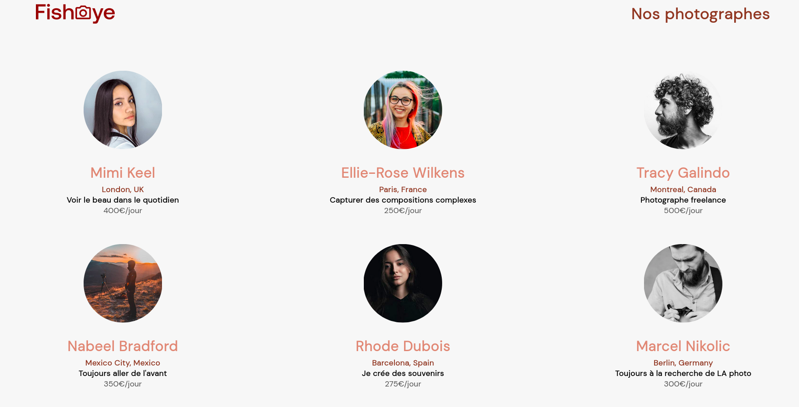

# Formation développeur d'application - Javascript React

## Créez un site accessible pour une plateforme de photographes
_Projet 6 - FishEye - Avril 2022_

## Mission 
Pour ce projet d'étude, le site doit correspondre aux maquettes fourni pour le TP, fonctionner correctement sans erreur dans la console; La priorité est l'accesibilité. bien vérifier que le site fonctionne bien avec le clavier. 

## Compétences évaluées  

* Assurer l'accessibilité d'un site web  
* Gérer les évènements d'un site avec JavaScript  
* Développer une application web modulaire avec des design patterns 
* Ecrire du code JavaScript maintenable

## Techno utilisés pour le projet  

* ### frontend
  * HTML
  * CSS
  * JavaScript
  

